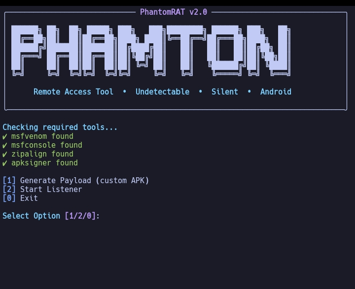

<p align="center">
  
</p>

# PhantomRAT
PhantomRAT is a powerful Android Remote Access Tool (RAT) designed for ethical hacking and penetration testing purposes. It offers features like payload generation, camera/mic access, file stealer, gallery dump, and more — all controlled from a terminal-based interface.
<p align="center">
  
  
  
  <br><br>
  <a href="https://discord.gg/3Gpv39Ca">
    
  </a>
  <a href="https://www.instagram.com/ano_ny_mous31">
    
  </a>
  <a href="https://www.threads.net/@ano_ny_mous31">
    
  </a>
  <a href="https://github.com/Ritusmin325k">
    
  </a>
  <a href="https://t.me/Ritusmin325k">
    
  </a>
</p>

## 🚀 Features

- Custom payload generation
- Post-exploitation commands (mic, camera, SMS, etc.)
- Auto file stealer (gallery, documents, etc.)

---

## 📸 Screenshot



## ⚠️ Disclaimer
This tool is intended for educational purposes only. The developer is not responsible for any misuse or damage caused by this tool.

By using this tool, you agree that:
You have proper authorization to test.
You will not use it for illegal activities.

## ⚙️ Requirements
Before running PhantomRAT, make sure the following dependencies are installed on your system:

- Python 3.8+
- Metaspoilt
- Apksigner
- Zipalign

## 📥 Installation

```bash
git clone https://github.com/Ritusmin325k/PhantomRAT.git
cd PhantomRAT
pip install -r requirements.txt
python3 rat2.py

